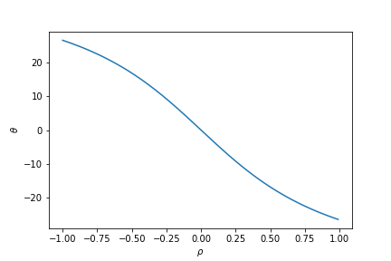

# 15周上课补充

$$
x \sim N(0,\sigma_1^2) \quad  y \sim N(0,\sigma_2^2) \quad
\begin{pmatrix}x\\ y \end{pmatrix} \sim N(\begin{pmatrix}0\\ 0 \end{pmatrix} , \Sigma )
$$

$$
g_{\sigma _x,\sigma_y}(x,y) = \frac{1}{2\pi\left | \Sigma  \right |^{\frac{1}{2}} }\exp\left(-\frac{\begin{pmatrix} x& y\end{pmatrix}\Sigma ^{-1}\begin{pmatrix}x\\y\end{pmatrix}}{2}\right)
$$

$$
\Sigma =  \begin{bmatrix}
E(x-\mu _x)^2 & E(x-\mu _x)(y-\mu _y) \\ 
E(x-\mu _x)(y-\mu _y) & E(y-\mu _y)^2
\end{bmatrix}  =  \begin{bmatrix} 
\sigma _1^2 & \rho \sigma _1\sigma _2 \\ 
\rho \sigma _1\sigma _2 & \sigma _2^2
\end{bmatrix}
$$

$$
\rho = \frac{E(x-\mu _x)(y-\mu _y)}{\sqrt{E(x-\mu _x)^2 E(y-\mu _y)^2 }} \quad ,\quad \left |\rho \right | \leq 1
$$

-------

$  \begin{aligned} 
g(x, y) & =\frac{1}{\left( 2 \pi \sigma_{1} \sigma_{2} \sqrt{1-\rho^{2}}\right)} \exp \left[-\frac{1}{2\left(1-\rho^{2}\right)}\left(\frac{\left(x-\mu_{1}\right)^{2}}{\sigma_{1}^{2}}-\frac{2 \rho\left(x-\mu_{1}\right)\left(y-\mu_{2}\right)}{\sigma_{1} \sigma_{2}}+\frac{\left(y-\mu_{2}\right)^{2}}{\sigma_{2}^{2}}\right)\right] \\
& =\frac{1}{\left( 2 \pi \sigma_{1} \sigma_{2} \sqrt{1-\rho^{2}}\right)} \exp \left[-\frac{\left(\sigma_{2}^{2} \left(x-\mu_{1}\right)^{2}-2 \sigma_{1} \sigma_{2}\rho\left(x-\mu_{1}\right)\left(y-\mu_{2}\right)+ \sigma_{1}^{2}\left(y-\mu_{2}\right)^{2}\right)}{2\left(1-\rho^{2}\right)\sigma_{1}^{2}\sigma_{2}^{2}}\right]
  \end{aligned}   $

-------

$$
\left( \begin{array}{ll}{a} & {b} \\ {c} & {d}\end{array}\right)^{-1}=\frac{1}{a d-b c} \left( \begin{array}{cc}{d} & {-b} \\ {-c} & {a}\end{array}\right)
$$

$$
\Sigma^{-1} = \begin{bmatrix}
\sigma _1^2 & \rho \sigma _1\sigma _2 \\ 
\rho \sigma _1\sigma _2 & \sigma _2^2
\end{bmatrix}^{-1}=  \frac{1}{(1- \rho^2) \sigma _1^2\sigma _2^2}
\begin{bmatrix}
\sigma _2^2 &  -\rho \sigma _1\sigma _2\\ 
-\rho \sigma _1\sigma _2 & \sigma _1^2
\end{bmatrix}
$$

### 空间旋转

$$
 A(\Sigma^{-1} ) = \begin{bmatrix} a & c\\ c & b \end{bmatrix} 
$$

A的二次型为$L(x,y) = ax^2+by^2+2cxy$

$$
\begin{bmatrix} x' \\ y' \end{bmatrix} = 
\begin{bmatrix}
 \cos \theta & \sin \theta  \\ 
-\sin \theta  & \cos \theta 
\end{bmatrix}\begin{bmatrix} x \\ y \end{bmatrix}(负角表示逆时针旋转) 
$$

==我们用的是这个，$(x,y)$旋转到$(x',y’)$==

---
$$
\begin{bmatrix} x\\ y \end{bmatrix} = 
\begin{bmatrix}
 \cos \theta & -\sin \theta  \\ 
\sin \theta  & \cos \theta 
\end{bmatrix}\begin{bmatrix} x'\\ y' \end{bmatrix}(正角表示逆时针旋转)
$$

$$
L(x',y')=a(x'\cos \theta-y'\sin \theta)^2+b(x'\sin \theta+y'\cos \theta)^2+ \\2c(x'\cos \theta-y'\sin \theta)(x'\sin \theta+y'\cos \theta)
$$

 交叉项
$$
 -2a\cos \theta \sin \theta +2b\sin \theta \cos \theta +2c\cos^2 \theta - 2c \sin^2 \theta \\= -a\sin 2\theta + b\sin 2 \theta + 2c\cos 2 \theta
$$
让$L(x',y')$ 没有交叉项，得到
$$
 -a\sin 2\theta + b\sin 2 \theta + 2c\cos 2 \theta = 0 \Rightarrow 
 \tan  2 \theta = \frac{2c}{a-b}  = \frac{2 \rho \sigma _1\sigma _2 }{ \sigma _1^2 -  \sigma _2^2} , \quad a \neq  b
$$

$$
 \theta =  \begin{cases}
\frac{1}{2} \arctan ( \frac{2 \rho \sigma _1\sigma _2 }{ \sigma _1^2 -  \sigma _2^2} ) & \text{ if } a \neq  b \\ 
\frac{\pi}{4} & \text{ if } a = b
\end{cases}
$$

|$\rho$|$ -1 \rightarrow  +1 $|
|:---:|:--:|
|$\theta$|$ + \rightarrow  - $|
|图|　顺时针 $\rightarrow $ 逆时针|

### Gabor

$$
\int_{-\infty }^{+\infty} exp\left[-ax^2 \right] exp\left[ -2\pi i x \xi \right] dx = \sqrt{\frac{\pi}{a} }{exp\left[ -\frac{\pi^2}{a}\xi^2 \right] }
$$

$f_0$频点调制
$$
\int_{-\infty }^{+\infty}  exp\left[-ax^2 \right]  exp\left[2\pi i x f_0 \right]  exp\left[-2\pi i x \xi \right] dx \\= \int_{-\infty }^{+\infty}  exp\left[-ax^2\right]  exp\left[-2\pi i x (\xi-f_0) \right] dx \\= \sqrt{\frac{\pi}{a} }{ exp\left[-\frac{\pi^2}{a} (\xi-f_0)^2 \right]}
$$

| 空间旋转 | 频点调制　| 频率旋转 |
|:---:|:--:|:--:|
| $ exp\left[-\frac{1}{2}(\frac{x'^2}{a^2} + \frac{y'^2}{b^2}) \right] $ | $exp\left[2\pi i (x' f_0+y' f_1) \right]$ |$ exp\left[-2\pi i (x'\xi'+y'\eta' )  \right]  $ |

