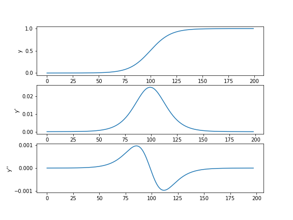
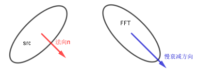

# 数字图像与视频处理   王桥

Copyright © 180776 胡欣毅.  All rights reserved. 

***复习提要 Version3*** 

本学期课程主要围绕一些图像处理的原理、Python/C++试验为主进行.
所讲内容并不多.考试侧重基础知识、基础算法与基础程序设计.

---
### 细胞功能(补充)

|视杆细胞　| 视锥细胞　|
|:--:|:--:|
| 亮度(黑白) | 色彩(颜色) |

### 图像的一般性知识、JPEG/PNG/GIF格式的差异、数据压缩的性能、使用的场景

|  JPEG   |   GIF    | PNG  |
|:---:|:---:|:---:|
| 有损压缩 | 无损压缩  |无损压缩  |

==以下全部百度,仅供参考==

* GIF全称Graphic Interchange Format ,图像交换格式,最多可使用256种颜色,适合导航条,按钮,图标等具有统一色调的图像,可以制作动态图像.当网速慢的时候可以将图像从模糊到清晰慢慢显示.
* JPEG全称Joint Photographic Experts Group ,图像压缩模式,可以包含数百万种颜色,文件大小和加载时间很大,不支持透明图和动态图,但能够保留全真的色调版格式,如果图像需要全彩模式才能表现效果,最好使用JPEG.
* PNG格式 全称Portable Network Graphics 提供了将图像文件以最小的方式压缩又不造成图像失真的技术.支持48位的色彩,更快地交错显示,跨平台的图像亮度控制,更多层的透明度设置.

---
1. Gif格式特点

- 透明性: Gif是一种布尔透明类型,既它可以是全透明,也可以是全不透明,但是它并没有半透明(alpha 透明).
- 动画: Gif这种格式支持动画.
- 无损耗性: Gif是一种无损耗的图像格式,这也意味着你可以对gif图片做任何操作也不会使  得图像质量产生损耗.
- 水平扫描: Gif是使用了一种叫作LZW的算法进行压缩的,当压缩gif的过程中,像素是由上到下水平压缩的,这也意味着同等条件下,横向的gif图片比竖向的gif图片更加小.例如500-10的图片比10-500的图片更加小
- 间隔渐进显示: Gif支持可选择性的间隔渐进显示

由以上特点看出只有256种颜色的gif图片不适合照片,但它适合对颜色要求不高的图形(比如说图标,图表等),它并不是最优的选择,我们会在后面中看到png是最优的选择.

2. Jpeg格式特点

- 透明性: 它并不支持透明.
- 动画: 它也不支持动画.
- 损耗性: 除了一些比如说旋转(仅仅是90、180、270度旋转),裁切,从标准类型到先进类型,编辑图片的原数据之外,所有其它操作对jpeg图像的处理都会使得它的质量损失.所以我们在编辑过程一般用png作为过渡格式.
- 隔行渐进显示: 它支持隔行渐进显示(但是ie浏览器并不支持这个属性,但是ie会在整个图像信息完全到达的时候显示).

由上可以看出Jpeg是最适web上面的摄影图片和数字照相机中.

3. Png格式特点

- 类型: Png这种图片格式包括了许多子类,但是在实践中大致可以分为256色的png和全色的png,你完成可以用256色的png代替gif,用全色的png代替jpeg
- 透明性: Png是完全支持alpha透明的(透明,半透明,不透明),尽管有两个怪异的现象在ie6(下面详细讨论)
- 动画: 它不支持动画
- 无损耗性: png是一种无损耗的图像格式,这也意味着你可以对png图片做任何操作也不会使  得图像质量产生损耗.这也使得png可以作为jpeg编辑的过渡格式
- 水平扫描: 像GIF一样,png也是水平扫描的,这样意味着水平重复颜色比垂直重复颜色的图片更小
- 间隔渐进显示: 它支持间隔渐进显示,但是会造成图片大小变得更大

4. 其它图片格式与PNG比较

众所周知GIF适合图形,JPEG适合照片,PNG系列两种都适合.

- 相比GIF
    - PNG 8除了不支持动画外,PNG8有GIF所有的特点,但是比GIF更加具有优势的是它支持alpha透明和更优的压缩.所以,大多数情况下,你都应该用PNG8不是GIF(除了非常小的图片GIF会有更好的压缩外).
- 相比JPEG
    - JPEG比全色PNG具有更加好的压缩,因此也使得JPEG适合照片,但是编辑JPEG过程中容易造成质量的损失,所以全色PNG适合作为编辑JPEG的过渡格式.

---

### 图像格式的基本常识、像素级检索的编程基础(矩阵)

RGB:(row,col,3)  Gray:(row,col)

彩图灰度图转化: $Gray = R \times 0.299 + G \times 0.587 + B \times 0.114 $ 

```bash
def rgb2gray(rgb):
    return np.dot(rgb[...,:3], [0.299, 0.587, 0.114])
```

==像素级操作的时候,索引[y,x] ([行值,列值])==

### 图像质量评价(补充)

精确的原始图像$f(x,y)$,从它的相关数据D(D可以是f的模糊版本),得到估计图像$\tilde{f}(m, n)$

均方误差 
$$
\mathrm{MSE}=\frac{1}{M N} \sum_{m=1}^{M} \sum_{n=1}^{N}|\tilde{f}(m, n)-f(m, n)|^{2}
$$

峰值信噪比 
$$
\mathrm{PSNR}=10 \lg \frac{255^{2}}{\mathrm{MSE}} \quad(\mathrm{dB})
$$

---
### 图像边缘检测的算法基础、一阶微分算子型与二阶微分算子型边缘检测算法的优劣对比、数据驱动的边缘检测算法,对应的程序设计

#### 一阶算子(差分值较大的区域为边缘)
对$\left | R_x f \right | + \left | R_y f \right | $取阈值判决,人工调阈值参数

* Roberts 交叉梯度算子
$$
\left[ \begin{array}{cc}{1} & {0} \\ {0} & {-1}\end{array}\right]  \quad   \left[ \begin{array}{cc}{0} & {-1} \\ {1} & {0}\end{array}\right]   
$$

* Prewitt 算子 
$$
 \left[ \begin{array}{ccc}{-1} & {-1} & {-1} \\ {0} & {0} & {0} \\ {1} & {1} & {1}\end{array}\right] \quad 
\left[ \begin{array}{rrr}{-1} & {0} & {1} \\ {-1} & {0} & {1} \\ {-1} & {0} & {1}\end{array}\right]  
$$

*  Sobel算子
$$
\left[ \begin{array}{ccc}{-1} & {-2} & {-1} \\ {0} & {0} & {0} \\ {1} & {2} & {1}\end{array}\right] \quad \left[ \begin{array}{rrr}{-1} & {0} & {1} \\ {-2} & {0} & {2} \\ {-1} & {0} & {1}\end{array}\right]  
$$

```bash
grad_x = cv2.filter2D(gray,  -1 , Ker_x )
grad_y = cv2.filter2D(gray,  -1 , Ker_y )
grad = abs(grad_x)  + abs(grad_y)  
#  调阈值
grad = (grad > 100) * 255
plt.imshow(grad,cmap='gray')
```

####  二阶算子(二阶差分的跨零点为边缘)
原则上==不需要取阈值==,跨零点即边界.
但是我自己编程用二阶差分较大的地方(二阶差分极大极小)近似代替跨零点,所以代码里面也有阈值需要调整.

* Laplace算子$\Delta $
==$\Delta f = \frac{\partial^2 f}{\partial x^2} + \frac{\partial^2 f}{\partial y^2} $==

$$
\begin{array}{l}{\frac{\partial^{2} f}{\partial x^{2}} \rightarrow f(i+1, j)-2 f(i, j)+f(i-1, j)} \\ {\frac{\partial^{2} f}{\partial y^{2}} \rightarrow f(i, j+1)-2 f(i, j)+f(i, j-1)}\end{array}
$$

所以得到第一个模板,第二、三为拓展模板

$$
 \left[ \begin{array}{ccc}{0} & {1} & {0} \\ {1} & {-4} & {1} \\ {0} & {1} & {0}\end{array}\right]\quad
\left[ \begin{array}{ccc}{1} & {1} & {1} \\ {1} & {-8} & {1} \\ {1} & {1} & {1}\end{array}\right]  \quad
\left[ \begin{array}{ccc}{1} & {4} & {1} \\ {4} & {-20} & {4} \\ {1} & {4} & {1}\end{array}\right]  
$$

*  LOG算子(带噪声的图像边沿检测)
$$
 \left[ \begin{array}{ccccc} 0&0&1&0&0\\ 0&1&2&1&0\\1&2& -16 &2&1\\     0&1&2&1&0\\  0&0&1&0&0 
\end{array} 
\right] 
$$

$$
LOG(f)(x,y) = \Delta(G_{\sigma }*f) = (\Delta G_{\sigma })*f  (微分、卷积算子次序可换) \\
G_{\sigma }(x,y) = \frac{1}{2\pi \sigma ^2}exp\left[ -\frac{x^2+y^2}{2\sigma^2} \right]  \\
\Delta G_{\sigma } =\frac{x^2+y^2 - 2\sigma^2 }{2\pi \sigma ^6}exp\left[ -\frac{x^2+y^2}{2\sigma^2} \right]
$$

---
证明:

$ \begin{aligned} 
G_{\sigma }(x,y) &= \frac{1}{2\pi \sigma ^2}exp\left[ -\frac{x^2+y^2}{2\sigma^2} \right] \\
\frac{\partial G_{\sigma } }{\partial x} &= \frac{1}{2\pi \sigma ^2}exp\left[ -\frac{x^2+y^2}{2\sigma^2} \right] \left( -\frac{x}{\sigma^2} \right) \\
\frac{\partial^2 G_{\sigma }}{\partial x^2} &=\frac{1}{2\pi \sigma ^2}exp\left[ -\frac{x^2+y^2}{2\sigma^2} \right] \left(\frac{x^2}{\sigma^4} -\frac{1}{\sigma^2} \right)\\
\frac{\partial^2 G_{\sigma }}{\partial y^2} &=\frac{1}{2\pi \sigma ^2}exp\left[ -\frac{x^2+y^2}{2\sigma^2} \right] \left(\frac{y^2}{\sigma^4} -\frac{1}{\sigma^2} \right)\\
\Delta G_{\sigma } & = \frac{1}{2\pi \sigma ^2}exp\left[ -\frac{x^2+y^2}{2\sigma^2} \right] \left(\frac{x^2+y^2}{\sigma^4} -\frac{2}{\sigma^2} \right) \\
& = \frac{x^2+y^2 - 2\sigma^2 }{2\pi \sigma ^6}exp\left[ -\frac{x^2+y^2}{2\sigma^2} \right]
\end{aligned} $

==注意,$ \Delta G_{\sigma }(x,y) $ 是一个小波==,即:$\int_{-\infty}^{+\infty} \int_{-\infty}^{+\infty} \Delta G_{\sigma }(x, y) d x d y=0$

证明:

$ \begin{aligned} 
& \int_{-\infty}^{+\infty} \int_{-\infty}^{+\infty} \Delta G_{\sigma }(x, y) d x d y \\
=\quad & \int_{-\infty}^{+\infty} \int_{-\infty}^{+\infty} \frac{x^2+y^2 - 2\sigma^2 }{2\pi \sigma ^6}exp\left[ -\frac{x^2+y^2}{2\sigma^2} \right] d x d y \\
=\quad & \int_{0}^{2\pi} \int_{0}^{+\infty}\frac{r^2 - 2\sigma^2 }{2\pi \sigma ^6}exp\left[ -\frac{r^2}{2\sigma^2} \right] rd r d \theta \\
=\quad & \frac{1 }{2\pi \sigma ^6}\int_{0}^{2\pi} d \theta \int_{0}^{+\infty}\left(r^3 - 2\sigma^2r \right) exp\left[ -\frac{r^2}{2\sigma^2} \right] d r \\
=\quad & \frac{1 }{\sigma ^6} \int_{0}^{+\infty}\left(r^3 - 2\sigma^2r \right) exp\left[ -\frac{r^2}{2\sigma^2} \right] d r \\
=\quad & \frac{-\sigma ^2 }{\sigma ^6}\left[  \left.(r^2-2\sigma^2)exp\left[-\frac{r^2}{2\sigma^2} \right]\right|_{0}^{+\infty} -\int_{0}^{+\infty} exp\left[-\frac{r^2}{2\sigma^2} \right] dr^2  \right] \\
=\quad & \frac{-1 }{\sigma ^4} \left[  2\sigma^2 +  2\sigma^2 \left. exp\left[-\frac{r^2}{2\sigma^2} \right] \right|_{0}^{+\infty}     \right] \\
=\quad & \frac{-1 }{\sigma ^4} \left[  2\sigma^2 -2\sigma^2     \right] = 0
\end{aligned} $

---

```bash
laplace = np.array([[1, 1, 1],
                    [1,-8, 1],
                    [1, 1, 1]])
grad = cv2.filter2D(gray,  -1 , laplace )
# 取二阶导数较大的点替代二阶导数接近 0 的位置
grad = (np.abs(grad) > 90) * 255
plt.imshow(grad,cmap='gray')
```

#### 数据驱动算法
* Canny

与二阶差分方法的区别(这里 ==\=0代表跨零点==)

| Canny | 二阶算子Laplace | 二阶算子LOG  |
|:---:|:---:|:---:|
| $ \frac{\partial^2 }{\partial n^2}(G_{\sigma }*f)=0 $ | $\Delta f = \frac{\partial^2 }{\partial n^2}f + \frac{\partial^2 }{\partial s^2}f=0 $ | $\Delta(G_{\sigma }*f) = \frac{\partial^2 }{\partial n^2}(G_{\sigma }*f) + \frac{\partial^2 }{\partial s^2}(G_{\sigma }*f)=0 $  |

==蕴含一个旋转不变性(各向同性)==  
当退化为离散形式时,该算子最多只能保证45度旋转的无关性

----
(**Def 旋转不变性**): Laplace算子是各向同性的,即假定$(x',y')$是$(x,y)$的旋转,则:

$$
\Delta=\frac{\partial^{2}}{\partial x^{\prime 2}}+\frac{\partial^{2}}{\partial y^{\prime 2}}=\frac{\partial^{2}}{\partial x^{2}}+\frac{\partial^{2}}{\partial y^{2}}
$$

证明:

$
\begin{bmatrix} x\\ y \end{bmatrix} = 
\begin{bmatrix}
 \cos \theta & -\sin \theta  \\ 
\sin \theta  & \cos \theta 
\end{bmatrix}\begin{bmatrix} x'\\ y' \end{bmatrix} $

$
x=x^{\prime} \cos \theta-y^{\prime} \sin \theta \\
 y=x^{\prime} \sin \theta+y^{\prime} \cos \theta$

$
\begin{aligned} 
\nabla^{2} f &=\frac{\partial^{2} f}{\partial x^{\prime 2}}+\frac{\partial^{2} f}{\partial y^{\prime 2}} \\ 
&=\frac{\partial}{\partial x^{\prime}}\left(\frac{\partial f}{\partial x^{\prime}}\right)+\frac{\partial}{\partial y^{\prime}}\left(\frac{\partial f}{\partial x^{\prime}}\right) \\ 
&=\frac{\partial}{\partial x^{\prime}}\left(\frac{\partial f}{\partial x} \frac{\partial x}{\partial x^{\prime}}+\frac{\partial f}{\partial y} \frac{\partial y}{\partial x^{\prime}}\right)+\frac{\partial}{\partial y^{\prime}}\left(\frac{\partial f}{\partial x} \frac{\partial x}{\partial y^{\prime}}+\frac{\partial f}{\partial y} \frac{\partial y}{\partial y^{\prime}}\right) \\ 
&=\frac{\partial}{\partial x^{\prime}}\left(\frac{\partial f}{\partial x} \cos \theta+\frac{\partial f}{\partial y} \sin \theta\right)+\frac{\partial}{\partial y^{\prime}}\left(-\sin \theta \frac{\partial f}{\partial x}+\cos \frac{\partial f}{\partial y}\right)   \\
&=\frac{\partial}{\partial x}\left(\frac{\partial f}{\partial x} \cos \theta+\frac{\partial f}{\partial y} \sin \theta\right) \frac{\partial x}{\partial x^{\prime}}+\frac{\partial}{\partial y}\left(\frac{\partial f}{\partial x} \cos \theta+\frac{\partial f}{\partial y} \sin \theta\right) \frac{\partial y}{\partial x^{\prime}} \\
 & \qquad +\frac{\partial}{\partial x}\left(-\sin \theta \frac{\partial f}{\partial x}+\cos \frac{\partial f}{\partial y}\right) \frac{\partial x}{\partial y^{\prime}}+\frac{\partial}{\partial y}\left(-\sin \theta \frac{\partial f}{\partial x}+\cos \frac{\partial f}{\partial y}\right) \frac{\partial y}{\partial y^{\prime}} \\
&=\frac{\partial}{\partial x}(  \frac{\partial f}{\partial x} \cos \theta+\frac{\partial f}{\partial y} \sin \theta ) \cos \theta+\frac{\partial}{\partial y}\left(\frac{\partial f}{\partial x} \cos \theta+\frac{\partial f}{\partial y} \sin \theta\right) \sin \theta \\
 & \qquad +\frac{\partial}{\partial x}\left(-\sin \theta \frac{\partial f}{\partial x}+\cos \frac{\partial f}{\partial y}\right)(-\sin \theta)+\frac{\partial}{\partial y}\left(-\sin \theta \frac{\partial f}{\partial x}+\cos \theta \frac{\partial f}{\partial y}\right) \cos \theta \\
&=\frac{\partial}{\partial x} \frac{\partial f}{\partial x}+\frac{\partial}{\partial y} \frac{\partial f}{\partial y} =\frac{\partial^{2} f}{\partial x^{2}}+\frac{\partial^{2} f}{\partial y^{2}} = \nabla^{2} f \end{aligned} $

----


工程上,对于图像, ==<u> ***$n$的方向只取4个: $0,\pi/4,\pi/2,3\pi/4$*** </u>==

$   \frac{\partial^2 }{\partial n^2}(G_{\sigma }*f)=0  \Leftrightarrow  \frac{\partial }{\partial n}(G_{\sigma }*f) 取极值  \Rightarrow   \left | \frac{\partial }{\partial n}(G_{\sigma }*f) \right | 取极大值  $

编程就先按梯度最大选出法向$n$ , 再给 $\left | \frac{\partial^2 }{\partial n^2}(G_{\sigma }*f) \right |  $设阈值求边缘.

```bash
# 自编函数版
def my_canny(src):   
    # 高斯低通滤波器
    gass = cv2.GaussianBlur(src, (3,3), 0)
    # canny 核 四个角度 一阶
    ker = np.zeros((3,3,4))
    ker[...,0] = np.array([[0,0,0],
                           [0,-1,1],
                           [0,0,0]])
    ker[...,1]  = np.array([[0,0,1],
                            [0,-1,0],
                            [0,0,0]])
    ker[...,2]  = np.array([[0,1,0],
                            [0,-1,0],
                            [0,0,0]])
    ker[...,3]  = np.array([[1,0,0],
                            [0,-1,0],
                            [0,0,0]])
    # 核 四个角度 二阶
    ker2 = np.zeros((3,3,4))
    ker2[...,0] = np.array([[0, 0,0],
                            [1,-2,1],
                            [0, 0,0]])
    ker2[...,1]  = np.array([[0, 0,1],
                             [0,-2,0],
                             [1, 0,0]])
    ker2[...,2]  = np.array([[0, 1,0],
                             [0,-2,0],
                             [0, 1,0]])
    ker2[...,3]  = np.array([[1, 0,0],
                             [0,-2,0],
                             [0, 0,1]])
    
    # 四个角度的差分
    d = np.zeros(src.shape +(4,))
    dd = np.zeros(src.shape +(4,))
    for i in range(4):
        d[...,i] = cv2.filter2D(src, -1 , ker[...,i])
        dd[...,i] = cv2.filter2D(src, -1 , ker2[...,i])
    
    n_f = np.ones_like(src)
    for row in range(src.shape[0]):
        for col in range(src.shape[1]):
            # 法向
            n = np.where( np.abs(d[row,col,:]) ==\
                         np.max(np.abs(d[row,col,:]) ))[0][0]

            n_f[row,col] = dd[row,col,n]
    return n_f

canny_out = my_canny(gray)
# 取二阶导数较大的点替代二阶导数接近 0 的位置
canny_out = (canny_out > 25) * 255
plt.imshow(canny_out,cmap='gray')
```
---

### 图像增强的Laplace算子方法,程序设计基础

* 一维边缘增强 $ res = y'- \lambda  y''  $



* 二维边缘增强 $ u_t(x,y) = u(x,y) - \lambda \Delta u(x,y)  $

  ==$\Delta$正中间值(这里是-4或-8)的符号与修正的正负号对应==,符号反的话就是反向模糊

$$
\Delta =   \left[ \begin{array}{ccc}{0} & {1} & {0} \\ {1} & {-4} & {1} \\ {0} & {1} & {0}\end{array}\right] \quad 或 \quad \left[ \begin{array}{ccc}{1} & {1} & {1} \\ {1} & {-8} & {1} \\ {1} & {1} & {1}\end{array}\right] 
$$

```bash
Laplace = np.array([[1, 1, 1],
                    [1,-8, 1],
                    [1, 1, 1]])
deta_f = cv2.filter2D(f,-1,Laplace)
labd = .5
re_build = f - (labd * deta_f).astype(int)
plt.imshow(re_build,cmap='gray')
```
---


### Gabor图像复原第一算法、第二算法的原理与实现(图像各向异性增强)
<u> ***Gabor适用的场景: 含噪声的图像增强*** </u>

* Laplace增强(法向、切向都增强,用于不含噪的图像增强)
$$
f_t(x,y) = f(x,y) - t(\frac{\partial^2 f }{\partial n^2} + \frac{\partial^2 f }{\partial s^2} )
$$

* 第一算法(法向增强)
$$
f_t(x,y) = f(x,y) - t \frac{\partial^2 f }{\partial n^2}  
$$

编程取 $\left | \frac{\partial }{\partial n}f \right | $最大值的方向为法向$n$,切向$s$为$n+\pi/2$.

```bash
def gabor1(src,t):   
    # 核 四个角度 一阶
    ker = np.zeros((3,3,4))
    ker[...,0] = np.array([[0,0,0],
                           [0,-1,1],
                           [0,0,0]])
    ker[...,1]  = np.array([[0,0,1],
                            [0,-1,0],
                            [0,0,0]])
    ker[...,2]  = np.array([[0,1,0],
                            [0,-1,0],
                            [0,0,0]])
    ker[...,3]  = np.array([[1,0,0],
                            [0,-1,0],
                            [0,0,0]])
    # 核 四个角度 二阶
    ker2 = np.zeros((3,3,4))
    ker2[...,0] = np.array([[0, 0,0],
                            [1,-2,1],
                            [0, 0,0]])
    ker2[...,1]  = np.array([[0, 0,1],
                             [0,-2,0],
                             [1, 0,0]])
    ker2[...,2]  = np.array([[0, 1,0],
                             [0,-2,0],
                             [0, 1,0]])
    ker2[...,3]  = np.array([[1, 0,0],
                             [0,-2,0],
                             [0, 0,1]])
    
    # 四个角度的差分
    d = np.zeros(src.shape +(4,))
    dd = np.zeros(src.shape +(4,))
    for i in range(4):
        d[...,i] = cv2.filter2D(src, -1 , ker[...,i])
        dd[...,i] = cv2.filter2D(src, -1 , ker2[...,i])
    
    n_f = np.ones_like(src)
    for row in range(src.shape[0]):
        for col in range(src.shape[1]):
            # 法向
            n = np.where( np.abs(d[row,col,:]) ==\
                         np.max(np.abs(d[row,col,:]) ))[0][0]

            n_f[row,col] = dd[row,col,n]
    return src - t * n_f

gabor = gabor1(gray,0.5)
```


* 第二算法(法向增强[-],切向平滑[+])
$$
f_t(x,y) = f(x,y) - t(\frac{\partial^2 f }{\partial n^2} - \frac{1}{3}\frac{\partial^2 f }{\partial s^2} ) = f(x,y) - t\frac{\partial^2 f }{\partial n^2} + \frac{t}{3}\frac{\partial^2 f }{\partial s^2} 
$$

```bash
def gabor2(src,t):   
    # 核 四个角度 一阶
    ker = np.zeros((3,3,4))
    ker[...,0] = np.array([[0,0,0],
                           [0,-1,1],
                           [0,0,0]])
    ker[...,1]  = np.array([[0,0,1],
                            [0,-1,0],
                            [0,0,0]])
    ker[...,2]  = np.array([[0,1,0],
                            [0,-1,0],
                            [0,0,0]])
    ker[...,3]  = np.array([[1,0,0],
                            [0,-1,0],
                            [0,0,0]])
    # 核 四个角度 二阶
    ker2 = np.zeros((3,3,4))
    ker2[...,0] = np.array([[0, 0,0],
                            [1,-2,1],
                            [0, 0,0]])
    ker2[...,1]  = np.array([[0, 0,1],
                             [0,-2,0],
                             [1, 0,0]])
    ker2[...,2]  = np.array([[0, 1,0],
                             [0,-2,0],
                             [0, 1,0]])
    ker2[...,3]  = np.array([[1, 0,0],
                             [0,-2,0],
                             [0, 0,1]])
    
    # 四个角度的差分
    d = np.zeros(src.shape +(4,))
    dd = np.zeros(src.shape +(4,))
    for i in range(4):
        d[...,i] = cv2.filter2D(src, -1 , ker[...,i])
        dd[...,i] = cv2.filter2D(src, -1 , ker2[...,i])
    
    n_f = np.ones_like(src)
    s_f = np.ones_like(src)
    for row in range(src.shape[0]):
        for col in range(src.shape[1]):
            # 法向
            n = np.where( np.abs(d[row,col,:]) ==\
                         np.max(np.abs(d[row,col,:]) ))[0][0]
            # 切向
            s = (n+2)%4
            n_f[row,col] = dd[row,col,n]
            s_f[row,col] = dd[row,col,s]
    return src - t * (n_f - s_f /3 )

gabor = gabor2(gray,0.5)
```
---

### Malik-Perona算法的原理与实现

**PM针对图像的边缘部分和非边缘部分进行不同性质的处理**
==图像边缘内部区域,c远离0,图像可以平滑;边缘附近,c接近0,图像不再平滑==

$$
径向函数: g(s)=exp\left[ -(\frac{s}{K})^2 \right] 或 g(s)=\frac{1}{1+\left(\frac{s}{K}\right)^{1+\alpha}},\alpha>0 (g:单调下降) \\
扩散函数: c(x,y,t) = g(\left | \bigtriangledown u    \right |) 
$$

$$
u(x,y, t) = u(x,y, 0) + t \frac{\partial u}{\partial t} (泰勒展开) \\
\frac{\partial u}{\partial t} =  \Delta u (热传导方程) \\
\frac{\partial u}{\partial t} = \bigtriangledown  \cdot (c(x,y,t) \bigtriangledown u )
= \bigtriangledown c(x,y,t) \cdot  \bigtriangledown u + c(x,y,t)\Delta u \\
$$

---

* 简化代码(根据微分运算符$\bigtriangledown$ 和 Laplace运算符$\Delta$进行拆解)
```bash
def g(s,k):
    return np.exp(-(s/k)**2)
def get_c(grad_u,k):
    return g(abs(grad_u),k)   

def PM1(src ,k = 12,lambd = .01 ):
    
    Ker_x = np.array([[-1, 0, 1], 
                      [-1, 0, 1], 
                      [-1, 0, 1]])
    Ker_y = np.array([[1, 1, 1], 
                      [0, 0, 0], 
                      [-1,-1,-1]])
    # Laplace扩展算子
    laplace = np.array([[1, 1, 1],
                        [1,-8, 1],
                        [1, 1, 1]])
    # grad_u
    grad_x = cv2.filter2D(src,  -1 , Ker_x )
    grad_y = cv2.filter2D(src,  -1 , Ker_y )
    grad_u = np.abs(grad_x)  + np.abs(grad_y) 
    # c
    c = get_c(grad_u,k = k)
    # grad_c
    grad_x_c = cv2.filter2D(src,  -1 , Ker_x )
    grad_y_c = cv2.filter2D(src,  -1 , Ker_y )
    grad_c = np.abs(grad_x_c)  + np.abs(grad_y_c)  
    # Laplace_u
    Laplace_u = cv2.filter2D(src,  -1 , laplace )
    # 
    im_out = (src + lambd*(grad_c * grad_u + c* Laplace_u ) )
    return im_out

# 迭代次数
step_num = 1
# copy
im_out1 = gray.astype(float)
for t in range(step_num):
    im_out1 = PM1( im_out1, k = 12,lambd = .002)
```

* 按书上逻辑代码(5个点(5个u)、涉及9个值的运算)

$$
\begin{aligned} 
u\left(x, y, t_{n+1}\right) 
& \approx u\left(x, y, t_{n}\right)+\delta t \nabla \cdot\left(c\left(x, y, t_{n}\right) \nabla u\left(x, y, t_{n}\right)\right) \\
 &=u\left(x, y, t_{n}\right)+\delta t\left[\nabla c\left(x, y, t_{n}\right) \cdot \nabla u\left(x, y, t_{n}\right)+c\left(x, y, t_{n}\right) \Delta u\left(x, y, t_{n}\right)\right]\\ 
 &=u\left(x, y, t_{n}\right)+\delta t\left[I_{1}^{n}+I_{2}^{n}\right] \end{aligned}
$$

$$
I_{1}^{n}+I_{2}^{n}=\frac{1}{2}\left[c_{i+1, j}^{n} \nabla_{\mathrm{S}} u_{i, j}^{n}+c_{i, j+1}^{n} \nabla_{\mathrm{E}} u_{i, j}^{n}+c_{i-1, j}^{n} \nabla_{\mathrm{N}} u_{i, j}^{n}+c_{i, j-1}^{n} \nabla_{\mathrm{W}} u_{i, j}^{n}\right]
$$

$$
\begin{aligned} \nabla_{\mathrm{S}} u_{i, j}^{n} &=u_{i+1, j}^{n}-u_{i, j}^{n} \\ \nabla_{\mathrm{E}} u_{i, j}^{n} &=u_{i, j+1}^{n}-u_{i, j}^{n} \\ \nabla_{\mathrm{N}} u_{i, j}^{n} &=u_{i-1, j}^{n}-u_{i, j}^{n} \\ \nabla_{\mathrm{W}} u_{i, j}^{n} &=u_{i, j-1}^{n}-u_{i, j}^{n} \end{aligned}
$$

$$
u_{i, j}^{n+1}=u_{i, j}^{n}+\lambda\left[c_{i+1, j}^{n} \nabla_{\mathrm{S}} u_{i, j}^{n}+c_{i, j+1}^{n} \nabla_{\mathrm{E}} u_{i, j}^{n}+c_{i-1, j}^{n} \nabla_{\mathrm{N}} u_{i, j}^{n}+c_{i, j-1}^{n} \nabla_{\mathrm{W}} u_{i, j}^{n}\right] (代码根据这句)
$$

```bash
def g(s,k):
    return np.exp(-(s/k)**2)
def f(s,k):
    return 1.0 / (1.0 + (s / k) ** 2)
    
def Perona_Malik(src , times =30,dt=.01 ,kappa =12, option = 1 ):  
    ny,nx = src.shape
    src = src.astype('float')
    # copy
    res = src
    tmp = src
    # 迭代次数
    for t in range(times):
        # 一次迭代
        for i in range(ny):
            for j in range(nx):
                # 位置信息 边界处理
                iUp   =  max(0,i - 1)
                iDown =  min(ny-1,i + 1)
                jLeft =  max(0,j - 1)
                jRight = min(nx-1,j + 1)
                
                # 书本page216  先计算  deta_u
                deltaN = tmp[iUp,j] - tmp[i,j]
                deltaS = tmp[iDown,j] - tmp[i,j]
                deltaE = tmp[i,jRight] - tmp[i,j]
                deltaW = tmp[i,jLeft] - tmp[i,j]
                delta_u = np.array([deltaN , deltaS , deltaE , deltaW ])

                # 计算  c
                if (option == 1):
                    c = g(np.abs(delta_u),kappa)
                elif (option == 2):
                    c = f(np.abs(delta_u),kappa)
                # 相乘相加 加权赋值
                res[i,j] += dt * (sum(c * delta_u) )
        tmp = res            
    return res
```
---

### 卷积信号估计(补充)
从$ g(x)=f(x)*h(x) $ 中得到 $ f(x)$的估计$\widetilde{f}$,即:$ min_{\widetilde{f}}\left \|\widetilde{f(x)}-f(x) \right \|  $


$$
\widehat{g} = \widehat{f}  \times \widehat{h} \Longrightarrow 
\widehat{g} \times \widehat{h}^* = \widehat{f} ( \widehat{h} \times \widehat{h}^* )\overset{引入\lambda 调整分母}{\Longrightarrow} 
\widehat{f} = \frac{\widehat{g}\times \widehat{h}^*}{ \widehat{h} \times \widehat{h}^* + \lambda }\\
f的估计 \widetilde{f} = \mathscr{F}^{-1} (\widehat{f} )
$$

### 图像矫正(补充)
dst:(x,y) ,  src:(u,v) [对于dst的点,去src找源点像素对应]

#### 仿射变换


$$
 \left[ \begin{matrix} x\\ y\\ 1 \end{matrix} \right] = M   \left[ \begin{matrix} u\\ v\\ 1 \end{matrix} \right]  \qquad 
M ^{-1}\left[ \begin{matrix} x\\ y\\ 1 \end{matrix} \right] =  \left[ \begin{matrix} u\\ v\\ 1 \end{matrix} \right] 
$$

#### 透视变换

$$
(x, y)=\left(\frac{M_{11} u+M_{12} v+M_{13}}{M_{31} u+M_{32} v+M_{33}}, \frac{M_{21} u+M_{22} v+M_{23}}{M_{31} u+M_{32} v+M_{33}} \right)  \\
x= \frac{M_{11} u+M_{12} v+M_{13}}{M_{31} u+M_{32} v+M_{33}}=\frac{\alpha T}{\gamma T} \qquad y = \frac{M_{21} u+M_{22} v+M_{23}}{M_{31} u+M_{32} v+M_{33}} = \frac{\beta T}{\gamma T}  \\
求解: \begin{bmatrix}
\alpha -x \times \gamma \\ 
\beta -y \times \gamma 
\end{bmatrix} T = 0
$$

其中
$ M = \begin{bmatrix}
\alpha \\ \beta \\ \gamma 
\end{bmatrix} \quad   T = \begin{bmatrix}
u \\ v\\ 1 
\end{bmatrix} $

#### 透视变换(改进)
$$
\left[ \begin{matrix} x'\\ y'\\ w \end{matrix} \right] = M  \left[ \begin{matrix} u\\ v\\ 1 \end{matrix} \right]  \quad  \frac{1}{w}\left[ \begin{matrix} x'\\ y'\\ w \end{matrix} \right] =  \left[ \begin{matrix} x\\ y\\ 1 \end{matrix} \right] =  \frac{1}{w} M  \left[ \begin{matrix} u\\ v\\ 1 \end{matrix} \right]
$$

$$
 M ^{-1}\left[ \begin{matrix} x\\ y\\ 1  \end{matrix} \right] =   \left[ \begin{matrix} u'\\ v'\\ t' \end{matrix} \right] = \frac{1}{w}  \left[ \begin{matrix} u\\ v\\ 1 \end{matrix} \right]  \quad   \left[ \begin{matrix} u\\ v \end{matrix} \right]  =   \left[ \begin{matrix}
u'/ t'\\ v'/ t' \end{matrix} \right] (t' = \frac{1}{w})
$$

---

### 微局部分析(补充)

要获得图像$f(x,y)$在$(a,b)$附近的信息. 先在空间域做局部化处理,找一个窗函数$h(x,y)$,使其窗口中心落在$(0,0)$,用这个窗函数对图像做局部化
$$
f(x, y) h(x-a, y-b)
$$

对局部化的图像做Fourier变换,计算:
$$
F_{h}(a, b ; \omega, \eta)=\int_{-\infty}^{+\infty} \int_{-\infty}^{+\infty} f(x, y) h(x-a, y-b) \mathrm{e}^{-\mathrm{j}(x \omega+y \eta)} \mathrm{d} x \mathrm{d} y
$$

**以幅度谱图的原点为中心,沿各个方向判断,哪个方向上Fourier变换的幅度衰减较慢**: ==慢衰减的方向实际就是原图中边缘曲线的法向. ==(与==FFT变换的模值梯度与图像(二维函数值)的梯度方向相垂直==对应理解)



---
微局部分析算法: 对图像$f(x,y)$在任意指定的位置$(a,b)$,寻找其变化剧烈的方向.
- 利用窗函数$h(x,y)$对图像做局部化.
- 对局部化图像$f(x,y)h(x-a,y-b)$做Fourier变换,算出$F(a,b;w,\eta)$.
- 在$(w,\eta)$平面上以$(0,0)$为中心,检查$|F(a,b;w,\eta)|$是否沿某个方向慢衰减。把所有的慢衰减方向$ \theta_1, \theta_1, \cdots ,\theta_K $找到,这些就是图像在点$(a,b)$位置的奇异性传播方向.

结论: 
- ***边缘越清晰的图,其对应的局部Fourier变换衰减越慢***
- ***边缘越模糊的图,其对应的局部Fourier 变换衰减越快,以至于难以判断出边缘的方向信息.***


### 二元Gauss函数的调控(伸缩、旋转)及其Fourier变换(微局部的滤波函数)

#### ***图像FFT***

==相位重构:相位信息在图像认知中起主导作用==

==FFT变换的模值梯度与图像(二维函数值)的梯度方向相垂直==


#### 二元Gauss函数的调控

$$
x \sim N(0,\sigma_1^2) \quad  y \sim N(0,\sigma_2^2) \quad
\begin{pmatrix}x\\ y \end{pmatrix} \sim N(\begin{pmatrix}0\\ 0 \end{pmatrix} , \Sigma )
$$

$$
g_{\sigma _x,\sigma_y}(x,y) = \frac{1}{2\pi\left | \Sigma  \right |^{\frac{1}{2}} }\exp\left(-\frac{\begin{pmatrix} x& y\end{pmatrix}\Sigma ^{-1}\begin{pmatrix}x\\y\end{pmatrix}}{2}\right)
$$

$$
\Sigma =  \begin{bmatrix}
E(x-\mu _x)^2 & E(x-\mu _x)(y-\mu _y) \\ 
E(x-\mu _x)(y-\mu _y) & E(y-\mu _y)^2
\end{bmatrix}  =  \begin{bmatrix} 
\sigma _1^2 & \rho \sigma _1\sigma _2 \\ 
\rho \sigma _1\sigma _2 & \sigma _2^2
\end{bmatrix}
$$

$$
\rho = \frac{E(x-\mu _x)(y-\mu _y)}{\sqrt{E(x-\mu _x)^2 E(y-\mu _y)^2 }} \quad ,\quad \left |\rho \right | \leq 1
$$

-------

$  \begin{aligned} 
g(x, y) & =\frac{1}{\left( 2 \pi \sigma_{1} \sigma_{2} \sqrt{1-\rho^{2}}\right)} \exp \left[-\frac{1}{2\left(1-\rho^{2}\right)}\left(\frac{\left(x-\mu_{1}\right)^{2}}{\sigma_{1}^{2}}-\frac{2 \rho\left(x-\mu_{1}\right)\left(y-\mu_{2}\right)}{\sigma_{1} \sigma_{2}}+\frac{\left(y-\mu_{2}\right)^{2}}{\sigma_{2}^{2}}\right)\right] \\
& =\frac{1}{\left( 2 \pi \sigma_{1} \sigma_{2} \sqrt{1-\rho^{2}}\right)} \exp \left[-\frac{\left(\sigma_{2}^{2} \left(x-\mu_{1}\right)^{2}-2 \sigma_{1} \sigma_{2}\rho\left(x-\mu_{1}\right)\left(y-\mu_{2}\right)+ \sigma_{1}^{2}\left(y-\mu_{2}\right)^{2}\right)}{2\left(1-\rho^{2}\right)\sigma_{1}^{2}\sigma_{2}^{2}}\right]
  \end{aligned}   $

-------

$$
二阶矩阵的逆: \left[ \begin{array}{ll}{a} & {b} \\ {c} & {d}\end{array}\right]^{-1}=\frac{1}{a d-b c} \left[ \begin{array}{cc}{d} & {-b} \\ {-c} & {a}\end{array}\right]
$$

$$
\Sigma^{-1} = \begin{bmatrix}
\sigma _1^2 & \rho \sigma _1\sigma _2 \\ 
\rho \sigma _1\sigma _2 & \sigma _2^2
\end{bmatrix}^{-1}=  \frac{1}{(1- \rho^2) \sigma _1^2\sigma _2^2}
\begin{bmatrix}
\sigma _2^2 &  -\rho \sigma _1\sigma _2\\ 
-\rho \sigma _1\sigma _2 & \sigma _1^2
\end{bmatrix}
$$

* ***伸缩***
$ \sigma_1 ,\sigma_2 $ 大小值代表椭圆的形状,差距越大,椭圆越扁

---

* ***空间旋转***

```bash
def rotate(image, angle, center=None, scale=1.0):
    ##　h,w 尺寸
    (h, w) = image.shape[:2]
    if center is None:
        center = (w // 2, h // 2)
 
    M = cv2.getRotationMatrix2D(center, angle, scale)
    # print(M) ## 旋转阵　＋　旋转中心
    # 旋转
    rotated = cv2.warpAffine(image, M, (w, h))
    return rotated
```

$$
 A(\Sigma^{-1} ) = \begin{bmatrix} a & c\\ c & b \end{bmatrix} 
$$

A的二次型为$L(x,y) = ax^2+by^2+2cxy$

$$
\begin{bmatrix} x' \\ y' \end{bmatrix} = 
\begin{bmatrix}
 \cos \theta & \sin \theta  \\ 
-\sin \theta  & \cos \theta 
\end{bmatrix}\begin{bmatrix} x \\ y \end{bmatrix}(负角表示逆时针旋转) 
$$

==我们用的是这个,$(x,y)$旋转到$(x‘,y‘)$==
$$
\begin{bmatrix} x\\ y \end{bmatrix} = 
\begin{bmatrix}
 \cos \theta & -\sin \theta  \\ 
\sin \theta  & \cos \theta 
\end{bmatrix}\begin{bmatrix} x'\\ y' \end{bmatrix}(正角表示逆时针旋转)
$$

$$
L(x',y')=a(x'\cos \theta-y'\sin \theta)^2+b(x'\sin \theta+y'\cos \theta)^2+ \\2c(x'\cos \theta-y'\sin \theta)(x'\sin \theta+y'\cos \theta)
$$

 交叉项
$$
 -2a\cos \theta \sin \theta +2b\sin \theta \cos \theta +2c\cos^2 \theta - 2c \sin^2 \theta \\= -a\sin 2\theta + b\sin 2 \theta + 2c\cos 2 \theta
$$
让$L(x',y')$ 没有交叉项,得到
$$
 -a\sin 2\theta + b\sin 2 \theta + 2c\cos 2 \theta = 0 \Rightarrow 
 \tan  2 \theta = \frac{2c}{a-b}  = \frac{2 \rho \sigma _1\sigma _2 }{ \sigma _1^2 -  \sigma _2^2} , \quad a \neq  b
$$

$$
 \theta =  \begin{cases}
\frac{1}{2} \arctan ( \frac{2 \rho \sigma _1\sigma _2 }{ \sigma _1^2 -  \sigma _2^2} ) & \text{ if } a \neq  b \\ 
\frac{\pi}{4} & \text{ if } a = b
\end{cases}
$$


|$\rho$|$ -1 \rightarrow  +1 $|
|:---:|:--:|
|$\theta$|$ + \rightarrow  - $|
|图|  顺时针 $\rightarrow $ 逆时针|


* ***Gabor***

$$
\int_{-\infty }^{+\infty} exp\left[-ax^2 \right] exp\left[ -2\pi i x \xi \right] dx = \sqrt{\frac{\pi}{a} }{exp\left[ -\frac{\pi^2}{a}\xi^2 \right] }
$$

---
证明:

$ \begin{aligned} 
& \int_{-\infty }^{+\infty} exp\left[-ax^2 \right] exp\left[ -2\pi i x \xi \right] dx \\
= & \int_{-\infty }^{+\infty} exp\left[-ax^2  -2\pi i x \xi \right] dx \\
= & \int_{-\infty }^{+\infty} exp\left[-a (x^2 + \frac{2\pi i \xi}{a}x ) \right] dx \\
= & \int_{-\infty }^{+\infty} exp\left[-a (x + \frac{\pi i \xi}{a} )^2 \right] 
exp\left[a \frac{\pi^2 i^2}{a^2}\xi^2 \right] dx \\
= & exp\left[- \frac{\pi^2 }{a}\xi^2 \right]\int_{-\infty + \frac{\pi i \xi}{a}}^{+\infty + \frac{\pi i \xi}{a}} exp\left[-a x^2 \right] dx  \\
= & exp\left[- \frac{\pi^2 }{a}\xi^2 \right]\int_{-\infty }^{+\infty } exp\left[-a x^2 \right] dx (插一步见下面)  \\
= & \sqrt{\frac{\pi}{a} }{exp\left[ -\frac{\pi^2}{a}\xi^2 \right] }
\end{aligned} $

补:求 $I=\int_{-\infty}^{+\infty} \mathrm{e}^{-a x^{2}} \mathrm{d} x$

方法一(二元积分):

$ \begin{aligned}  
I^{2} &=\int_{-\infty}^{+\infty} \int_{-\infty}^{+\infty} \mathrm{e}^{- a \left(x^{2}+y^{2}\right)} \mathrm{d} x \mathrm{d} y  \\  
&=\int_{0}^{2 \pi} \mathrm{d} \theta \int_{0}^{+\infty} \mathrm{e}^{- a \rho^{2}} \rho \mathrm{d} \rho \\  
& = \frac{-\pi}{a} \int_{0}^{+\infty } e^{-a \rho ^2} d(-a \rho ^2)\\ 
&= \frac{-\pi}{a} \left. e^{-a \rho ^2} \right|_0 ^{+ \infty } = \frac{\pi}{a} 
\end{aligned} $ 

方法二(正太分布概率密度):

$ \begin{aligned} 
 & \frac{1}{\sqrt{2\pi} \sigma } \int_R e^{-\frac{x^2}{2\sigma^2}}dx = 1 \\
\Rightarrow & I = \int_R e^{-\frac{x^2}{2\sigma^2}}dx = \sqrt{2\pi} \sigma (\frac{1}{2\sigma^2} = a, \sigma  = \sqrt{\frac{1}{2a}})\\
\Rightarrow & I = \int_R e^{-a x^2} dx = \sqrt{2\pi} \sigma = \sqrt{2\pi} \sqrt{\frac{1}{2a}} = \sqrt{\frac{\pi}{a}}
\end{aligned} $

---

$f_0$频点调制
$$
\int_{-\infty }^{+\infty}  exp\left[-ax^2 \right]  exp\left[2\pi i x f_0 \right]  exp\left[-2\pi i x \xi \right] dx \\= \int_{-\infty }^{+\infty}  exp\left[-ax^2\right]  exp\left[-2\pi i x (\xi-f_0) \right] dx \\= \sqrt{\frac{\pi}{a} }{ exp\left[-\frac{\pi^2}{a} (\xi-f_0)^2 \right]}
$$

| 空间旋转 | 频点调制  | 频率旋转 |
|:---:|:--:|:--:|
| $ exp\left[-\frac{1}{2}(\frac{x'^2}{a^2} + \frac{y'^2}{b^2}) \right] $ | $exp\left[2\pi i (x' f_0+y' f_1) \right]$ |$ exp\left[-2\pi i (x'\xi'+y'\eta' )  \right]  $ |
---

### 对课程作业要多思考

***这个得看命***

<center> <font face="楷体" color=red size=30> 王老师万岁!!! </font> </center>

